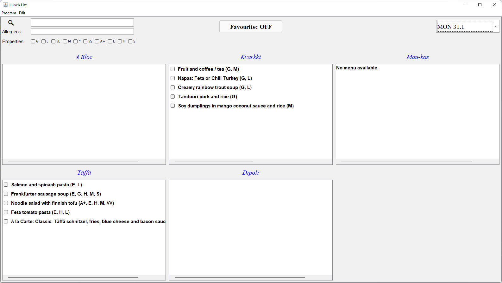

# Lunch List application
## Introduction
The project is the an implementation of the course CS-C2120 Programming Studio 2: Project.  
An application represents a lunch list of multiple restaurants in Otaniemi.

## Interface

